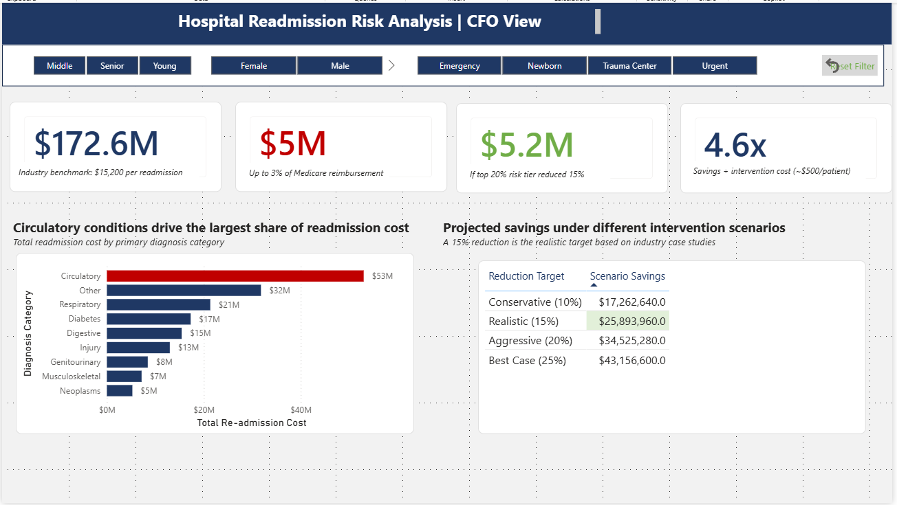
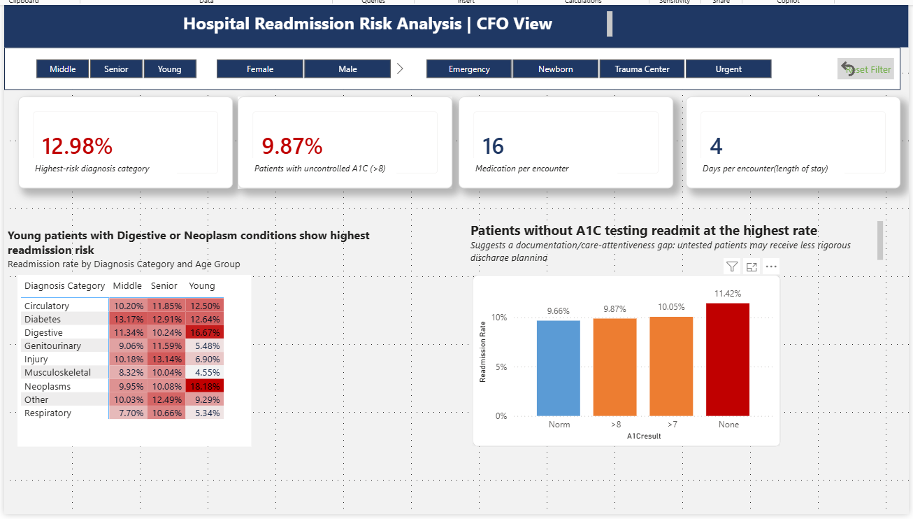
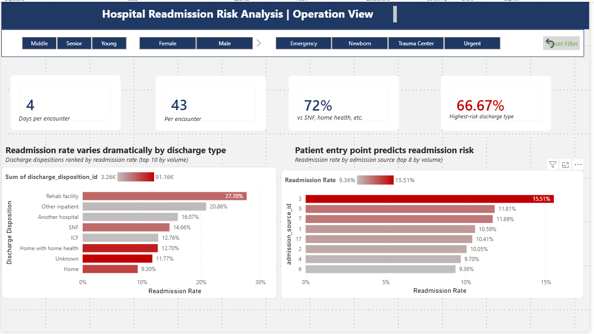

# Hospital Readmission Risk Analysis

> A multi-page Power BI dashboard analyzing 30-day readmission patterns across 130 U.S. hospitals — translating clinical data into financial, clinical, and operational recommendations for executive stakeholders.


---

## The Business Problem

Under the U.S. Centers for Medicare & Medicaid Services (CMS) Hospital Readmissions Reduction Program (HRRP), hospitals face penalties of up to **3% of Medicare reimbursement** for excess 30-day readmissions — typically **$1–3M per hospital annually**. Diabetic patients have higher readmission rates than the general population, making them a primary focus for intervention programs.

This project analyzes **101,766 patient encounters across 130 U.S. hospitals (1999–2008)** to identify the demographic, clinical, and operational drivers of readmission, and translates findings into actionable recommendations for the CFO, Chief Medical Officer, and Operations Director.

---

## Dashboard Preview

### Page 1 — Executive Overview


The landing page. Headline KPIs, the strongest readmission drivers, and the risk-concentration heatmap.

### Page 2 — CFO View: Financial Impact



Translates clinical signals into dollars. Total cost, penalty exposure, recoverable savings, and intervention ROI.

### Page 3 — Clinical View



A1C analysis, diagnosis × age heatmap, and patient risk profiles for the Chief Medical Officer.

### Page 4 — Operations View



Discharge disposition patterns and admission source analysis for workflow optimization.

---

## Key Findings

- **11.16% of diabetic patients are readmitted within 30 days** — below the CMS penalty threshold (~15%) but well above industry best-practice (~8%), representing significant improvement opportunity.

- **Risk is highly concentrated, not distributed.** Young patients with 6+ prior hospital visits readmit at **38.55%** — more than 3x the average. This single segment represents ~8% of patient volume but a disproportionate share of readmissions.

- **Discharge destination predicts readmission risk.** Patients discharged to **rehab facilities readmit at 27.7%** vs. 9.3% for patients sent home — a 3x difference suggesting handoff/care-coordination failures.

- **Counterintuitive A1C finding:** Patients without a documented A1C test readmit at higher rates than patients with uncontrolled A1C (>8) — pointing to a documentation/care-attentiveness gap rather than disease severity as the driver.

- **Total estimated annual cost: $172.6M** at the industry-benchmark $15,200 cost-per-readmission. Targeted intervention on the High Risk tier could recover an estimated **$5.2M annually at a 4.6x ROI** on a $500/patient transitional care program.

---

## Methodology

The analysis followed standard healthcare analytics practice for readmission studies:

- **Excluded clinically impossible cases** — patients with discharge codes 11, 13, 14, 19, 20, 21 (deceased or transitioning to hospice) cannot, by definition, be readmitted. Including them would artificially deflate the rate.

- **Deduplicated by patient_nbr** — some patients had 20+ encounters in the dataset. Keeping all encounters violates statistical independence and would cause data leakage in any predictive model. Kept the first encounter per patient.

- **Bucketed ICD-9 codes into 9 medical categories** — the raw `diag_1` column contained 700+ unique codes. Consolidated into Circulatory, Diabetes, Respiratory, Digestive, Injury, Musculoskeletal, Genitourinary, Neoplasms, and Other using standard ICD-9 range mapping with handling for V-codes and E-codes.

- **Decoded categorical IDs into readable labels** — `discharge_disposition_id` and `admission_source_id` were stored as numeric codes in the source data. Mapped each to its human-readable name (Home, SNF, Rehab facility, etc.) so downstream visualizations communicate to non-technical stakeholders.

- **Engineered three risk-segmentation features** — Age Group (Young/Middle/Senior), Visit Group (0/1–2/3–5/6+ prior visits), and a 3-tier Risk Tier calculated column combining prior visits with A1C control.

---

## Tools & Techniques

| Layer | Technology |
|---|---|
| Data prep & EDA | Python, Pandas, NumPy, Jupyter |
| Visualization | Matplotlib, Seaborn |
| Dashboard | Power BI Desktop, DAX, Power Query |
| Modeling features | Calculated columns, Calculated tables, Conditional formatting |
| Documentation | Markdown, Git, GitHub |

**Key analytical techniques:** Cohort analysis, feature engineering, ICD-9 code mapping, missing-value strategy decisions, dimensional modeling, conditional formatting for storytelling, multi-page dashboard architecture with synced filters across stakeholder personas.

---

## Repository Structure

```
hospital-readmission-analysis/
├── README.md
├── dashboard/
│   ├── readmission_dashboard.pbix
│   └── screenshots/
│       ├── page1_overview.png
│       ├── page2_cfo.png
│       ├── page3_cmo.png
│       └── page4_operations.png
├── notebooks/
│   └── 01_eda.ipynb
├── data/
│   └── README.md
├── .gitignore
└── LICENSE
```

---

## How to Reproduce

1. **Clone this repository:**
   ```
   git clone https://github.com/bala4483-git/hospital-readmission-analysis.git
   ```

2. **Download the dataset** from the [UCI Machine Learning Repository](https://archive.ics.uci.edu/dataset/296/diabetes+130-us+hospitals+for+years+1999-2008) and place `diabetic_data.csv` in the `data/` folder.

3. **Run the EDA notebook** to verify the data preparation steps:
   ```
   jupyter notebook notebooks/01_eda.ipynb
   ```

4. **Open the dashboard** by launching `dashboard/readmission_dashboard.pbix` in Power BI Desktop.

---

## Limitations & Future Work

- **Dataset age:** The data spans 1999–2008. Clinical practices, drug formularies, and discharge protocols have evolved significantly since then. Findings should be validated against contemporary data before driving operational decisions.

- **Cost figures use industry benchmarks, not actuals.** The $15,200/readmission and $500/patient intervention assumptions are widely cited but vary by hospital, payer mix, and region. A production version would integrate with the hospital's billing system.

- **Diabetic-only cohort.** Findings don't generalize to non-diabetic admissions. The risk concentration patterns may differ for cardiac-only or surgical-only populations.

**Possible extensions:** Add a logistic regression / gradient boosted tree model with SHAP feature importance to formally validate the descriptive findings; build a longitudinal view if multi-year intervention outcomes data becomes available; embed the dashboard into an EHR for real-time discharge planning.

---

## Data Source & Citation

**Dataset:** Diabetes 130-US Hospitals for Years 1999–2008
**Source:** UCI Machine Learning Repository
**License:** [CC BY 4.0](https://creativecommons.org/licenses/by/4.0/legalcode)

**Citation:** Clore, J., Cios, K., DeShazo, J., & Strack, B. (2014). *Diabetes 130-US Hospitals for Years 1999–2008* [Dataset]. UCI Machine Learning Repository. https://doi.org/10.24432/C5230J

---

## About Me

I am **Bala Dasari**, a Senior Business Systems Analyst with 9+ years of experience delivering enterprise technology solutions across banking, logistics, and healthcare. I specialize in requirements engineering, REST API integration, CIAM/KYC/AML workflows, Agile/SAFe delivery, and Power BI dashboard development — with hands-on data analytics capabilities in Python and SQL.

Currently based in Vancouver, BC and open to Senior BSA / Technical BA opportunities.

- Vancouver, BC
- [dasarib065@gmail.com](mailto:dasarib065@gmail.com)
- [LinkedIn](https://linkedin.com/in/bala-d-45b423275)
- [GitHub](https://github.com/bala4483-git)

---

*This dashboard was developed as a portfolio project to demonstrate end-to-end analytical capability — from raw data preparation through executive-ready visualizations.*
